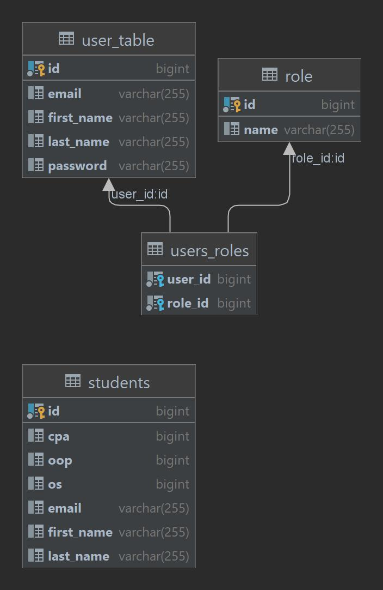
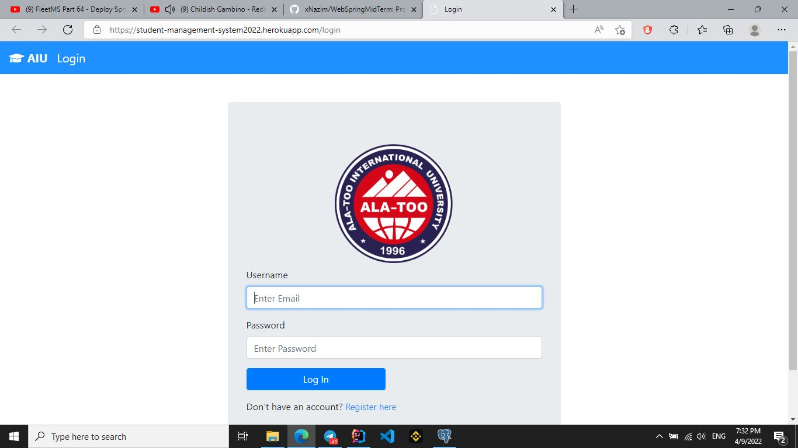
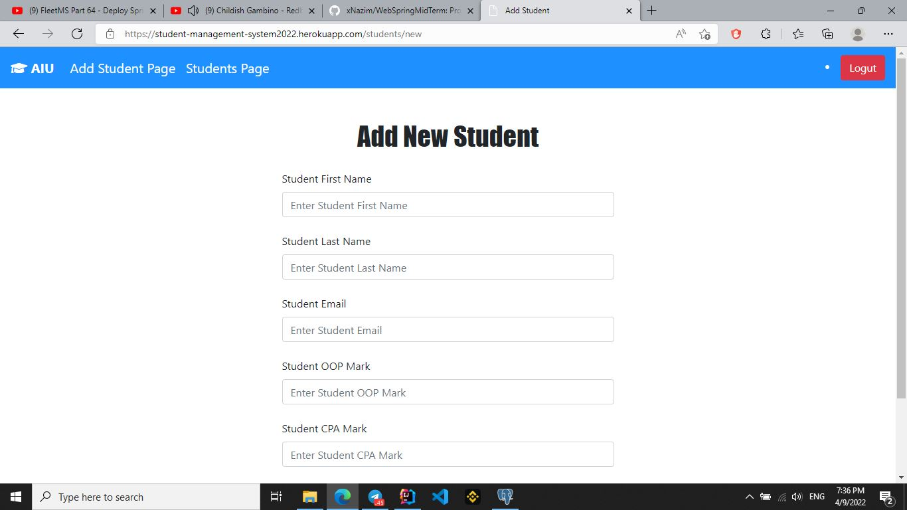

# *CS 204: Back-end Development with Spring Framework (Final)*
## Student Management System

Simple and fully responsive Student Management System using Spring Boot, Thymeleaf and PostgresSQL database.

It works with 4 tables: *students, role, users-roles, user-table*.
Only admin can add or delete students;
## - login: **admin**
## - password: **Admin2022**

Students can register and see their marks, if they exist in table.

# Tools and technologies used:
- *Java 11*
- *Spring Boot*
- *Spring Data JPA (Hibernate)*
- *PostgresSQL*
- *Thymeleaf*
- *Bootstrap 4*

## ER Diagram of DB

## *Some screenshots*

# Deployment process
 ## We deployed our project to AWS. 
## Firstly we connected our database to RDS.

## Then we created an environment for our web server. While creating the environment Elastic Beanstalk created and launched an instance.

## We connected to the instance and deployed our files to Elastic Beanstalk.

## Also we attached the instance to Elastic Load Balancer(ELB) which automatically distributes incoming application traffics.

## You can see our web-site

