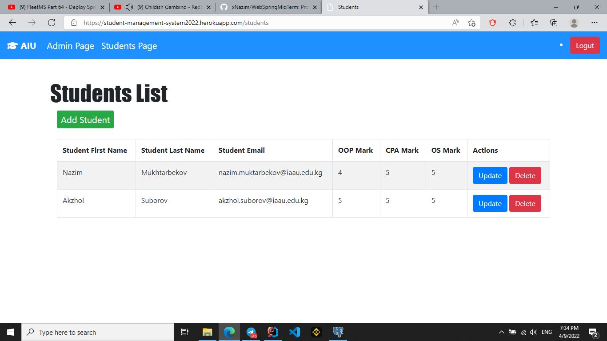

# *CS 204: Back-end Development with Spring Framework (Mid-Term)*
## Student Management System

Simple and fully responsive Student Management System using Spring Boot, Thymeleaf and PostgresSQL database.

It works with 4 tables: *students, role, users-roles, user-table*.
Only admin can add or delete students;
## - login: **admin**
## - password: **Admin2022**

Students can register and see their marks, if they exist in table.

# Tools and technologies used:
- *Java 11*
- *Spring Boot*
- *Spring Data JPA (Hibernate)*
- *PostgresSQL*
- *Thymeleaf*
- *Bootstrap 4*

## ER Diagram of DB

## *Some screenshots*

